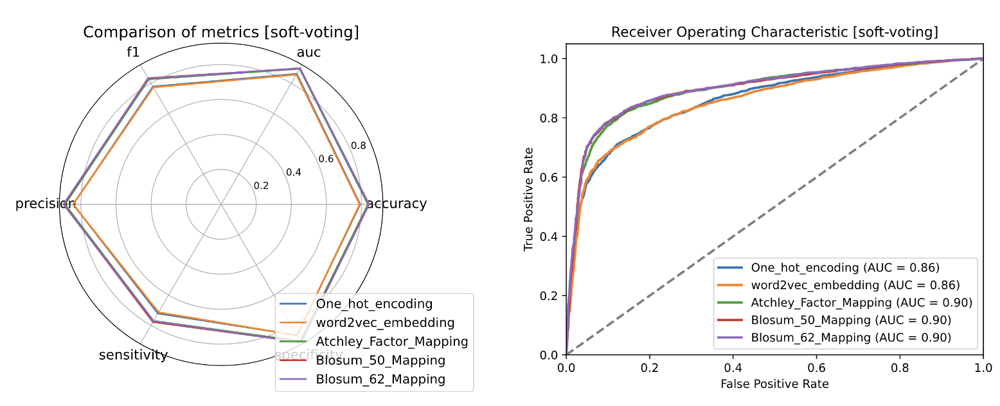

# TCR-Epitope Binding Affinity Prediction

CS5483 Group Project from **Group 6**

| **Group Member** | **Student ID** |
| ------------ | ---------- |
| YANG Yongze  | 58162280   |
|ZOU Jiaxi|58481506|
|DUAN Suyang|58490066|
|FANG Mingyuan|58132226|

For our full project, please refer to our Jupyter Notebook file: [Project](Project.ipynb), which documents our full documentation and code, as well as all attempts at this project.

## 1. Introduction

### 1.1 Gneral Introduction

In the intricate dance of the immune system, pathogens introduce a suite of proteins to the body, serving as the inciting agents known as antigens. These antigenic proteins are instrumental in triggering an immune response, a phenomenon attributed to discrete segments within them—epitopes. The interaction between epitopes and the immune cell receptors, specifically the T Cell Receptor (TCR), is a critical determinant in the cascade of events that lead to the production of antibodies and the activation of the body's defense mechanisms.

Our project zeroes in on the capacity of specific epitopes to engage with TCRs. When an epitope successfully binds to a TCR, it catalyzes a T cell into an 'activated T cell,' which then differentiates into two pivotal cell types: the Plasma cell and the Memory T cell. The Plasma cell is responsible for the immediate production of antibodies, which are proteins that can identify and neutralize the pathogen. Conversely, the Memory T cell serves as a long-term sentinel, primed to swiftly mobilize Plasma cells upon subsequent exposures to the same antigen, thereby accelerating the immune response. This memory function is the cornerstone of vaccine efficacy and the rationale behind our research focus.

*fig 1: T Cell Reacts to Pethogen*

The relevance of understanding the binding capabilities of various peptide sequences (epitopes) with TCRs extends to the development of vaccines and the creation of immunosuppressive drugs. Our study scrutinizes the relationship between different amino acid sequence fragments, epitopes, and the CDR3 region of TCRs, which is pivotal in determining the binding affinity. By predicting the binding potential, our analysis aims to contribute to the broader understanding of immunological recognition and facilitate advancements in therapeutic strategies.

### 1.2. Dataset Introduction

Our dataset is referenced from the collation of Cai, Michael, et al.[5], which is a comprehensive dataset meticulously curated from publicly available databases, including VDJdb, McPAS-TCR, and IEDB. 

Our dataset is composed of 36,088 binding relationship of TCR-epitope pairs, a substantial collection that provides a robust platform for predictive modeling. The dataset is complete, with no missing values, and the target variable, 'binding', which indicates whether an interaction occurs between the TCR and the epitope, is perfectly balanced.

The dataset is structured into three primary fields:

| **Field** | **Description** |
| ------------ | ---------- |
| epitope  | Amino Acid sequence of the epitope   |
|CDR3|Amino Acid sequence of CDR3 on the T Cell|
|binding|whether the epitope reacts with the CDR3|

## 2. Feature Engineering & Pre-Processing

### 2.1 Feature Engineering

Since the 'epitope' and 'CDR3' in our dataset, which refer to a part of a pipetide, is a sequence of amino acids expressed in string, feature engineering is needed to extract the feature of the sequence of amino acids from the string. Based on previous research, we applied 5 different ways to do so.

One-Hot Encoding offers a straightforward representation of the presence or absence of amino acids; Word2Vector is capable of capturing contextual information of amino acids; Atchley Factor Mapping and BLOSUM provide more complex representations based on physicochemical properties and evolutionary conservation. Within the BLOSUM method, we have selected two commonly used Substitution Matrices, BLOSUM 50 and BLOSUM 62. Utilizing these five approaches, we have constructed a feature set that can be employed in data mining models to analyze and predict the likelihood of amino acid segments binding to T-cell surface receptors.

We ignored the unusual amino acids in the sequence and only take into consideration the 20 natural amino acid in human body.

*fig2: An overview of our dataset*

#### 2.1.1 One-Hot Encoding

This is an intuitive encoding method that treats each amino acid as a distinct categorical variable. Rather than tallying the occurrence of each amino acid within the sequence, this method assigns a unique binary vector to represent the presence or absence of each amino acid in the sequence. With 20 types of amino acids, each sequence is thus represented by a 20-dimensional vector indicating the presence or absence of the natural amino acids in the peptide.

*fig 3: One-hot encoding on piptides in our dataset*

#### 2.1.2 Word2Vec

This method is borrowed from natural language processing techniques, treating amino acid sequences as a form of "language" where amino acids are akin to words. The Word2Vector algorithm generates a fixed-length vector for each "word" (i.e., each amino acid), designed to capture the contextual information and semantic features of the amino acid. Then all the vectors (i.e., the single amino acid) are added up to a vector of the whole "sentence" (i.e., the piptide). This can extract the similarities between different amino acids and their relative positions within the sequence.

*fig 4: Word2Vec encoding one piptide*

One-hot encoding and Word2Vec both only consider the feature of the string, treating the amino acids as alphabets. The following methods take the physiochemical properties of the amino acids into consideration. Padding is needed to make the sequences into equal length before we apply the subsequent encoding methods.

*fig 5: Padding to make the seuqences into equal length (36)*

#### 2.1.3 Atchley Factor Mapping

Atchley Factor Mapping is an encoding method based on the physicochemical properties of amino acids. Each amino acid is assigned multiple values based on its specific physicochemical attributes, such as hydrophobicity and side chain size. In our project, we assigned five values to each amino acid in the sequence. These Atchley Factors are pre-defined in Atchley et al.[2]

In the padded sequences, according to Luu et al [3], we added a label to each amino acid. Amino acids from the original sequence correspond to a label of 1, while the padded positions have a label value of 0. Besides, all the Atchley Factors for padded positions are set to 0.5.

*fig 6: Atchley factor mapping on our dataset*

#### 2.1.4 BLOcks SUBstitution (Applied Both BLOSUM 50 & 62 Substitution Matrix)

The BLOSUM matrix is an encoding method based on the frequency of amino acid substitutions, derived from statistical analysis of conserved regions within large protein families. BLOSUM matrices (such as BLOSUM50 or BLOSUM62) provide a scoring system to assess the likelihood of one amino acid being substituted for another. Here, BLOSUM50 represents the substitution matrix at a 50% sequence similarity, while BLOSUM62 represents the matrix at 62% sequence similarity. Using the BLOSUM matrix, each amino acid can be represented by a vector containing the substitution scores of that amino acid with all other amino acids. It's like representing each amino acids with its relative physiochemical features with other amimo acids.

We tried both BLOSUM50 and BLOSUM62 to encode the piptides in our dataset
*fig 7: BLOSUM Substitution Matrics (BLOSUM62 as example)*

*fig 8: BLOSUM encoding on our dataset*
### 2.2 Pre-Processing

After encoding the piptides in our dataset, mainmax normalisation is conducted to uniform the features.

As some of the encoding methods outputs matrix or 2d arrays, feature concatenation is also conducted.

*fig 9: Dataset after feature engineering and pre-processing*

## 3. Model Training

For this binary classification task, we selected KNN, Random Forest, XG Boost, Gradient Boost, ADA Boost and SVC (with Linear, Polynominal and RBF as kernels) as our models.

As the input dataset ishigh dimensional, we conducted GridSearch to find the best hyper parameter set for the models. A Naive Bayes model is first used to test the GridSearch method and gave satisfactory results. The GridSearch method is then performed on all our models. AUROC is selected as the evaluation Criteria.

*fig 10: Hyper parameter space for GridSearch*

## 4. Model Ensembling (Soft Vote Classifier)

After getting each model's best performing hyper parameters and the optimal models, the overall performance of the models are still not satisfactory. So we tried the soft voting method to ensemble the models.

*fig 11: Models and their optimal hyper parameters*

After ensembling our best voting classifier's accuracy reached 84.15%, with BLOSUM62 as encoding method.  

*fig 12: Metrics radar plot and ROC curve for soft-voting*

The soft-voting classifier does not give better results than some individual classifiers (for example, the AUC for XGBoost with Atchley Factor/BLOSUM50/62 is 0.90, which is the same as soft-voting with Atchley Factor/BLOSUM50/62), and we speculate that it is possible that this is because some poorly performing classifiers are in there to degrade its performance.

From the point of view of feature representation,  results indicate that for amino acid sequences, physicochemical properties are more appropriate to represent, for example, the Atchley Factor and Blosum scoring matrices.

For all of our results, as well as the ROC curves and metric radar curves for each classifier, check out our jupyter documentation, which documents all of our attempts to complete this project. Here are some of our results:

|                       | **One-hot** | **WordsVec** | **Atchley** | **Blosum50** | **Blosum62** |
| ----------------------- | --------- | ---------- | --------- | ---------- | ---------- |
| Bernoulli Naive Bayes | 0.78    | 0.50     | 0.77    | 0.77     | 0.77     |
| Random Forest         | 0.86    | 0.85     | 0.89    | 0.89     | 0.89     |
| ADABoost              | 0.81    | 0.76     | 0.82    | 0.82     | 0.82     |
| XGBoost               | 0.86    | 0.85     | 0.90    | 0.90     | 0.90     |
| Gradient Boosting     | 0.86    | 0.83     | 0.88    | 0.88     | 0.88     |
| KNN                   | 0.86    | 0.86     | 0.90    | 0.90     | 0.90     |
| Soft-Voting           | 0.86    | 0.86     | 0.90    | 0.90     | 0.90     |

## 5. Reference

[1] Le, Quoc, and Tomas Mikolov. "Distributed representations of sentences and documents." International conference on machine learning. PMLR, 2014.

[2] Atchley, William R., et al. "Solving the protein sequence metric problem." Proceedings of the National Academy of Sciences 102.18 (2005): 6395-6400.

[3] Luu, Alan M et al. “Predicting TCR-Epitope Binding Specificity Using Deep Metric Learning and Multimodal Learning.” Genes vol. 12,4 572. 15 Apr. 2021, doi:10.3390/genes12040572

[4] Henikoff, Steven, and Jorja G. Henikoff. "Amino acid substitution matrices from protein blocks." Proceedings of the National Academy of Sciences 89.22 (1992): 10915-10919.

[5] Cai, Michael, et al. "ATM-TCR: TCR-epitope binding affinity prediction using a multi-head self-attention model." Frontiers in immunology 13 (2022): 893247.

